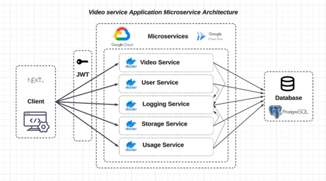
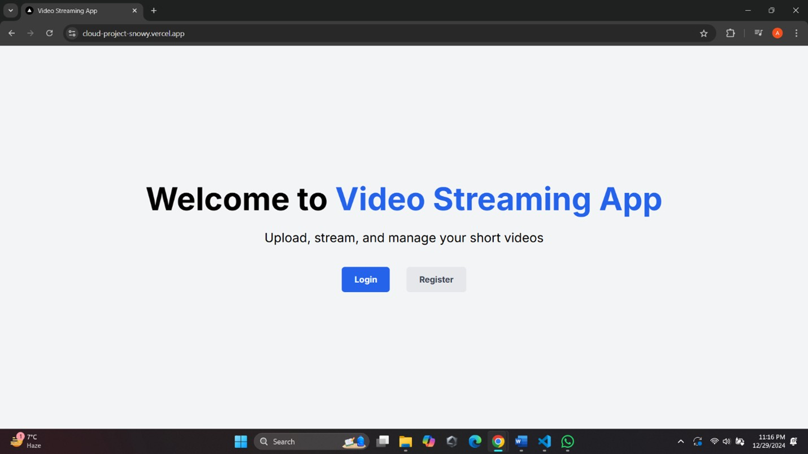
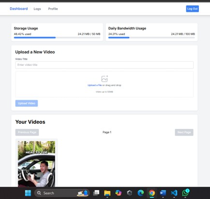
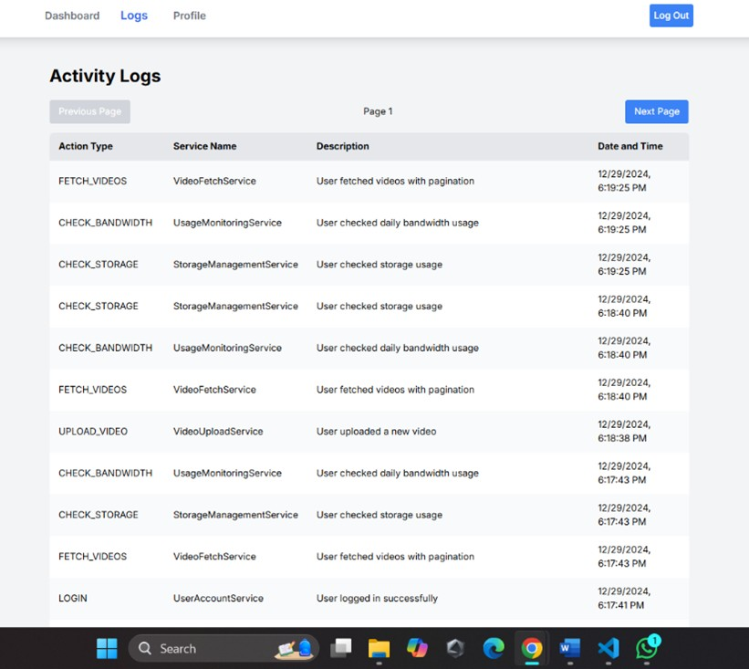

### Frontend README

# Video Streaming Application - Frontend 🚀

Welcome to the frontend repository of the **Video Streaming Application**! This project is a cloud-based short video streaming platform built with **Next.js**. It provides an intuitive, responsive user interface that allows users to upload, manage, and view videos seamlessly. The frontend communicates with various backend microservices for user authentication, video management, logging, and more—ensuring a robust and scalable streaming experience.

## 🚀 Project Links

- **Backend Repository**: [GitHub - Backend](https://github.com/ahmedbilal008/Video-Streaming-Platform-backend-) (Tested with Apache JMeter, includes performance result screenshots)
- **Live Application**: [Cloud Project on Vercel](https://cloud-project-snowy.vercel.app/)
- **Test Credentials**:  
  - Email: `example1@gmail.com`  
  - Password: `123456`  
  *(This account has admin access to view logs)*

---

## 📖 Table of Contents

- [Project Overview](#project-overview)
- [Features](#features)
- [Tech Stack](#tech-stack)
- [Getting Started](#getting-started)
- [Architecture Overview](#architecture-overview)
- [Frontend UI Screenshots](#frontend-ui-screenshots)
- [Conclusion](#conclusion)

---

## 📌 Project Overview

This project is a **microservices-based cloud application** designed for **scalable and efficient video streaming**. It leverages modern web technologies and cloud platforms to deliver a smooth, high-performance user experience.

---

## 🎯 Features

- **User Authentication**: Secure login and registration using JWT tokens 🔒  
- **Video Upload & Management**: Easily upload, delete, and monitor video storage 🎥  
- **Streaming**: Optimized video playback for a seamless viewing experience ▶️  
- **Usage Monitoring**: Tracks bandwidth and storage limits 📊  
- **Admin Logs**: Access system logs and user activity (Admin only) 📝  
- **Scalable Microservices**: Integrates with backend services deployed on GCP ☁️

---

## 🛠 Tech Stack

- **Frontend**: Next.js, React, Tailwind CSS  
- **Backend**: Node.js, Express.js (Microservices)  
- **Database**: PostgreSQL (Supabase)  
- **Storage**: Cloudinary  
- **Hosting**: Vercel (Frontend), Google Cloud Run (Backend)

---

## 💻 Getting Started

### Clone the Repository
```bash
git clone https://github.com/ahmedbilal008/Video-Streaming-Platfrom-Frontend-.git
cd Video-Streaming-Platfrom-Frontend-
```
### Install Dependencies
```bash
npm install   # or yarn install
```

### Run the Development Server
```bash
npm run dev   # or yarn dev
```
Open [http://localhost:3000](http://localhost:3000) in your browser.

---

## 🏗 Architecture Overview

The frontend is built with **Next.js** and communicates with a suite of backend microservices responsible for user authentication, video management, logging, storage, and usage monitoring.

**How It Works:**
1. The **User Service** authenticates users and issues JWT tokens.
2. The **Video Service** manages uploads, retrievals, and deletions.
3. The **Logging Service** records user and system activities asynchronously.
4. The **Storage Service** monitors and manages user storage quotas.
5. The **Usage Service** enforces bandwidth and usage limits.
### Application Architecture


---
## 🖼 Frontend UI Screenshots
### Login Page


### Dashboard


### User Logs


### Profile


---

## 📜 Conclusion

The **Video Streaming Platform** frontend provides a seamless and engaging user experience, leveraging Next.js and modern cloud microservices. Explore the project and enjoy coding!
